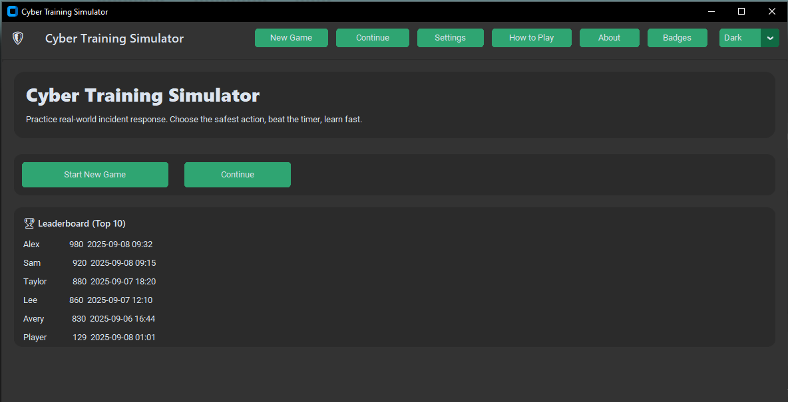
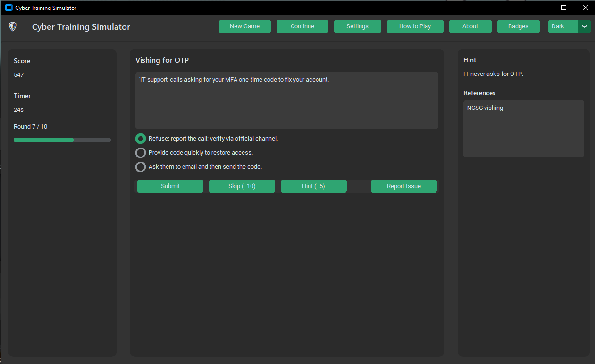
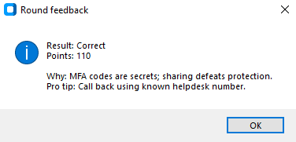
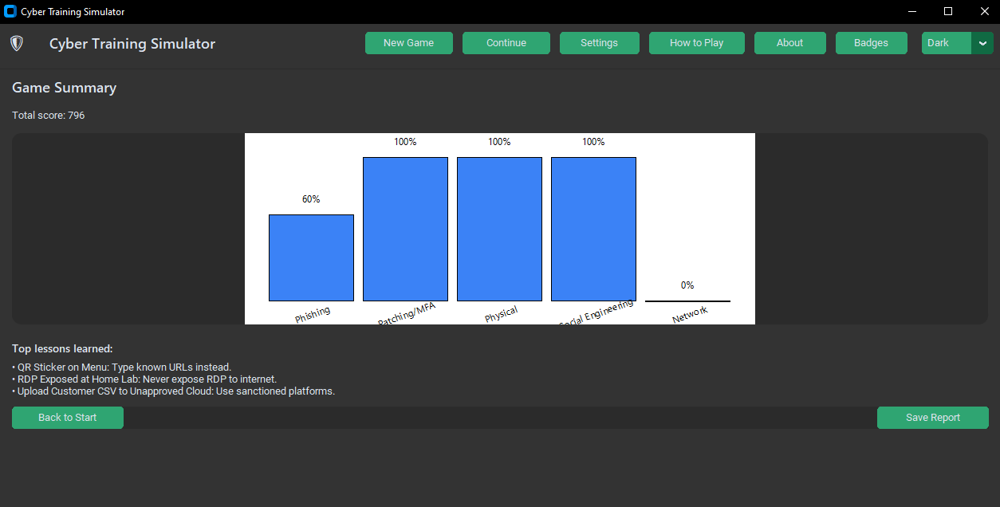
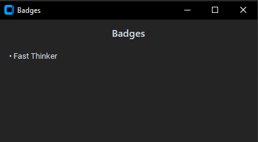

# 🛡️ Cyber Training Simulator (Python + CustomTkinter)

A polished desktop app that turns real-world cyber incidents into an interactive training game.  
Built with **Python 3** and **CustomTkinter**. No internet calls. All data is stored locally.

 
 


Practice secure decision-making across realistic scenarios (phishing, MFA fatigue, tailgating, open ports, and more).  
Make a choice, see instant feedback, and review analytics at the end.

---

## ✨ Highlights

- **22+ curated scenarios** across Phishing, Network, Social Engineering, Physical, and Patching/MFA.  
- **Scoring** with streak bonus, fast-response bonus, and configurable penalties.  
- **Modern UI (CustomTkinter)** — Dark/Light theme toggle, clean cards, toasts, keyboard shortcuts.  
- **Analytics**: per-category accuracy bar chart + “Top lessons learned”.  
- **Persistence**: profiles, settings, badges, leaderboard, and exportable Markdown reports.  
- **Local-only**: data saved to `./data/` with JSON auto-backup on parse errors.  

---

## 🚀 Quickstart

### 1) Optional: create a virtual environment
```bash
python -m venv .venv

# Windows:
.venv\Scripts\activate

# macOS/Linux:
source .venv/bin/activate
```

### 2) Install UI dependency
```bash
pip install customtkinter
```

### 3) Run
```bash
python main.py
```

---

## 📸 Screenshots

Here’s a look at the app in action:

### Start Screen


### Scenario Example


### Feedback Modal


### Summary & Analytics


### Badges


---

## 🏆 Badges & Achievements
- **Phish Fryer** – Get 5 phishing scenarios correct.  
- **Zero Trust** – Finish without using skips.  
- **Fast Thinker** – Average response under 10s.  
- **Patch Master** – All patching/update scenarios correct.  

---

## 📊 Analytics & Leaderboard
- Per-category accuracy  
- Average decision time  
- Most-missed scenario  
- Local **Top 10 leaderboard** with scores and dates  

---

## 🛠️ Development Notes

- **Language:** Python 3.10+  
- **Dependencies:** only `customtkinter` (GUI)  
- **Modules:** `main.py`, `ui.py`, `game.py`, `settings.py`, `storage.py`, `analytics.py`, `scenarios.json`  
- **Tests:** run with  
  ```bash
  python -m unittest
  ```

---

## 📜 License

MIT License © 2025 Alfie Healy
